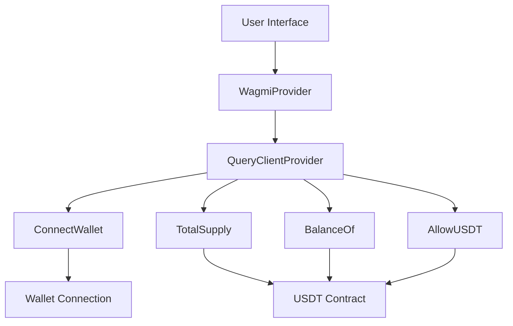
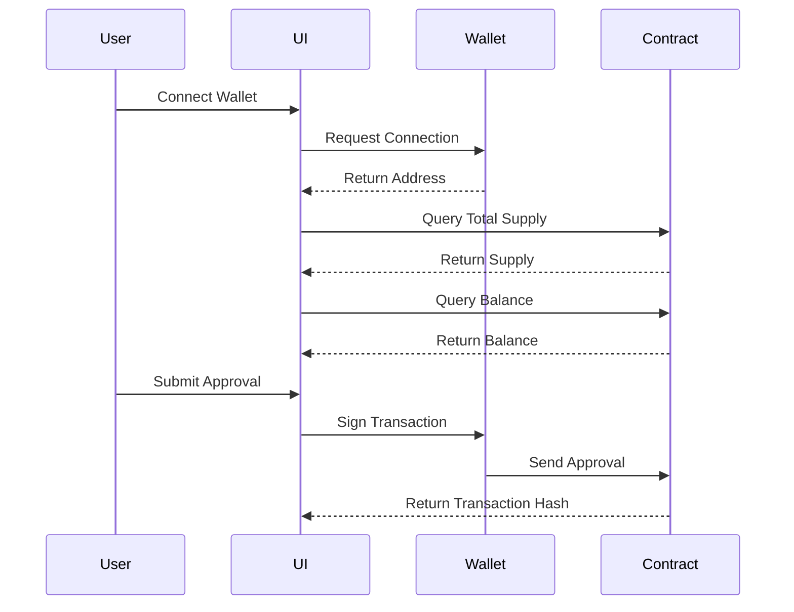
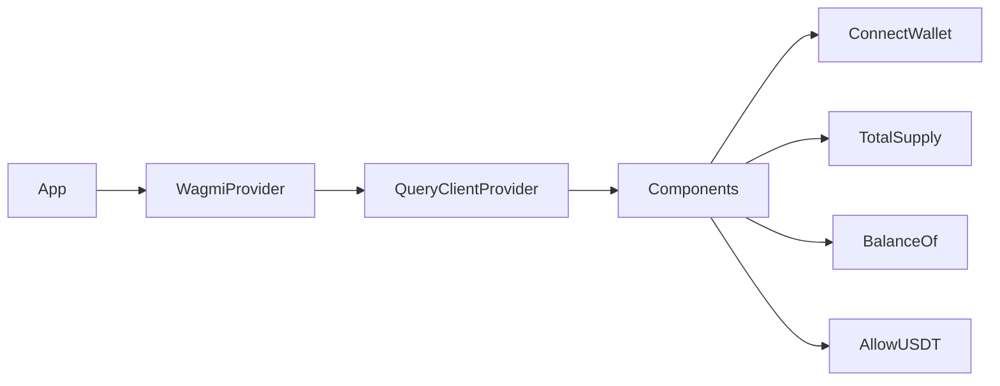

# USDT Balance and Approval dApp

A decentralized application for interacting with the USDT (Tether) smart contract on Ethereum Mainnet. This dApp allows users to check USDT total supply, view their balance, and approve USDT spending.

## 🔍 Features

- Connect to Ethereum wallet (MetaMask and other injected wallets)
- View USDT total supply
- Check personal USDT balance
- Approve USDT spending for another address

## 🏗 Architecture



## 📊 Data Flow



## 🛠 Tech Stack

- React 19
- TypeScript
- Vite
- Wagmi (Ethereum interactions)
- TanStack Query (Data management)
- Viem (Ethereum library)

## 🚀 Getting Started

1. Clone the repository
2. Install dependencies:
   ```bash
   npm install
   ```
3. Create a `.env` file with your Alchemy API key:
   ```
   REACT_APP_ALCHEMY_ID=your_alchemy_key
   ```
4. Start the development server:
   ```bash
   npm run dev
   ```

## 📦 Contract Information

The dApp interacts with the USDT contract on Ethereum Mainnet:
- Address: `0xdac17f958d2ee523a2206206994597c13d831ec7`
- Network: Ethereum Mainnet

## 🔐 Security

- All transactions require user confirmation through their wallet
- Contract interactions are read-only except for the approval function
- No private keys or sensitive data are stored in the application

## 🧪 Component Structure



## 📝 Contract Functions

The dApp uses the following USDT contract functions:
- `totalSupply()`: Returns the total supply of USDT
- `balanceOf(address)`: Returns the USDT balance of an address
- `approve(address,uint256)`: Approves an address to spend USDT

## 🤝 Contributing

Contributions are welcome! Please feel free to submit a Pull Request.

## 📄 License

This project is licensed under the MIT License - see the LICENSE file for details.
